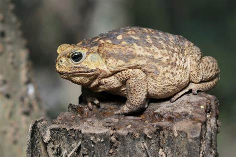

# Relatório Classificação de Imagem (Cifar10)

## CIFAR-10: Descrição

O CIFAR-10 é um dos conjuntos de dados mais populares na área de visão computacional e aprendizado de máquina. Consiste em um conjunto de imagens coloridas de baixa resolução (32x32 pixels), divididas em 10 classes distintas. Cada classe contém 6.000 imagens, totalizando 60.000 imagens no conjunto de dados.

### Classes:
1. Avião
2. Automóvel
3. Pássaro
4. Gato
5. Cervo
6. Cachorro
7. Sapo
8. Cavalo
9. Navio
10. Caminhão

### Divisão dos Conjuntos:
- **Treinamento**: Contém 50.000 imagens, utilizadas para treinar modelos de classificação de imagens.
- **Teste**: Contém 10.000 imagens, utilizadas para avaliar o desempenho dos modelos treinados.

## Bibliotecas Utilizadas

- **TensorFlow**: Utilizado para construção e treinamento de modelos de aprendizado profundo.
- **NumPy**: Essencial para manipulação de arrays e operações matemáticas.
- **Matplotlib**: Utilizado para visualização de dados, como gráficos e imagens.
- **Flask**: Utilizado para construir e servir a API.
- **PIL (Python Imaging Library)**: Utilizado para manipulação de imagens, especialmente para converter entre diferentes formatos de imagem.
- **ImageDataGenerator**: Da biblioteca `tensorflow.keras.preprocessing.image`, utilizado para aumentar os dados de imagem durante o treinamento do modelo.
- **callbacks**: Da biblioteca `tensorflow.keras`, utilizado para monitorar e controlar o treinamento do modelo, como parar o treinamento quando uma métrica específica atinge um valor desejado.

--

## Preparação de Dados com Data Augmentation

Antes do treinamento da rede neural, os dados de entrada passaram por um processo de aumento de dados, conhecido como data augmentation. Esta técnica é amplamente utilizada para aumentar a diversidade do conjunto de treinamento, o que pode melhorar a generalização do modelo e reduzir o overfitting.

### Técnicas de Data Augmentation Utilizadas:

Foram aplicadas as seguintes técnicas de data augmentation:

1. **Rotação**: As imagens foram rotacionadas aleatoriamente em um intervalo de ângulos especificado. Isso ajuda a expor o modelo a diferentes orientações dos objetos nas imagens.

2. **Espelhamento Horizontal**: As imagens foram espelhadas horizontalmente aleatoriamente. Isso permite que o modelo aprenda a reconhecer objetos independentemente da sua orientação na imagem.

3. **Zoom**: Um fator de zoom aleatório foi aplicado nas imagens, ampliando ou reduzindo-as. Isso aumenta a variação no tamanho dos objetos nas imagens.

4. **Deslocamento de Altura e Largura**: As imagens foram deslocadas verticalmente e horizontalmente em uma fração da altura e largura da imagem, respectivamente. Isso introduz pequenas variações na posição dos objetos nas imagens.

### Aplicação do Data Augmentation:

O aumento de dados foi aplicado durante o treinamento do modelo, utilizando a classe `ImageDataGenerator` da biblioteca `tensorflow.keras.preprocessing.image`. Esta classe permite que as transformações de data augmentation sejam aplicadas em tempo real durante o treinamento, sem a necessidade de armazenar as imagens aumentadas em disco.

--

## Criação da Rede Neural

A arquitetura da rede neural foi construída utilizando a biblioteca TensorFlow, especificamente a API Keras, que oferece uma interface intuitiva para construção e treinamento de modelos de aprendizado profundo.

### Arquitetura do Modelo:

O modelo foi construído como uma sequência de camadas utilizando a classe `Sequential` do Keras. As camadas foram organizadas da seguinte forma:

1. **Camadas Convolucionais e Pooling**:
   - Foram adicionadas camadas convolucionais para extrair características das imagens de entrada. Essas camadas aplicam filtros convolucionais à imagem.
   - Em seguida, camadas de max pooling foram adicionadas para reduzir a dimensionalidade da representação e extrair características importantes.
   - Batch normalization foi aplicado após cada camada convolucional para normalizar as ativações e acelerar o treinamento.

2. **Camada Fully Connected (Densa)**:
   - Após as camadas convolucionais, os recursos extraídos foram achatados em um vetor unidimensional.
   - Foram adicionadas camadas densas para aprender padrões mais complexos nos dados.
   - Dropout foi aplicado para prevenir overfitting, desativando aleatoriamente um percentual dos neurônios durante o treinamento.

3. **Camada de Output**:
   - A camada final é uma camada densa com ativação softmax, que produz a distribuição de probabilidade sobre as 10 classes do CIFAR-10.

### Compilação e Treinamento:

O modelo foi compilado utilizando o otimizador Adam e a função de perda `sparse_categorical_crossentropy`, que é adequada para problemas de classificação com várias classes.
O treinamento foi realizado em mini-lotes (batch) utilizando o método `fit`, onde os dados foram aumentados em tempo real durante o treinamento utilizando técnicas de data augmentation, como rotação, espelhamento horizontal, e deslocamento de altura e largura.

### Early Stopping:

Foi implementado o Early Stopping utilizando a função de callback do Keras para monitorar a perda no conjunto de validação e interromper o treinamento caso não haja melhora após um número específico de épocas (patience).

--

## API de Classificação de Imagens CIFAR-10

Esta API foi desenvolvida utilizando o framework Flask em Python e um modelo de rede neural convolucional treinado para classificação de imagens no conjunto de dados CIFAR-10.

### Endpoints Disponíveis:

- **/predict** (Método: POST): Este endpoint recebe uma imagem enviada como parte de uma requisição POST multipart/form-data e retorna a classe prevista para a imagem.

### Utilização da API:

1. **Preparação da Imagem**:
   Antes de enviar uma imagem para predição, você precisa prepará-la para que tenha o mesmo formato e tamanho que o modelo espera. Isso inclui redimensionar a imagem para 32x32 pixels e normalizá-la, se necessário.

2. **Envio da Requisição**:
   Envie uma requisição POST para o endpoint /predict da API, incluindo a imagem como um arquivo multipart/form-data.

3. **Recebimento da Resposta**:
   A API processará a imagem recebida, realizará a predição utilizando o modelo treinado e retornará a classe prevista para a imagem em formato JSON.
   
--

## Resultados do modelo:

Nos testes foram inseridos 5 imagens diferentes para entender o funcionamento do modelo sendo de avião, cachorro, gato, veado e sapo

### Teste avião
**Imagem de avião retirada do Google**

**Resultado avião**

Percebe-se que o modelo foi assertivo na classificação de avião.

### Teste cachorro
**Imagem de cachorro retirada do Google**

**Resultado cachorro**

Percebe-se que o modelo foi assertivo na classificação de cachorro.

### Teste gato
**Imagem de gato retirada do Google**

**Resultado gato**

Percebe-se que o modelo foi assertivo na classificação de gato.

### Teste veado
**Imagem de veado retirada do Google**

**Resultado veado**

Percebe-se que o modelo foi assertivo na classificação de veado.

### Teste sapo
**Imagem de sapo retirada do Google**

**Resultado sapo**

Percebe-se que o modelo foi assertivo na classificação de sapo.

